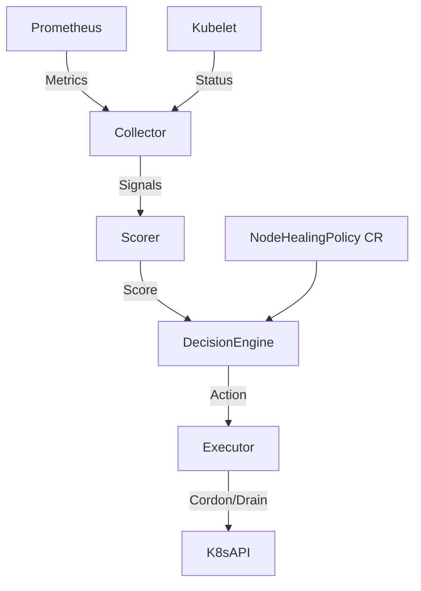

# Self-Healing Kubernetes Node Pool Controller

A Kubernetes controller that detects degraded nodes using custom signals (Prometheus metrics) and remediates them (Cordon, Drain, Replace) to maintain cluster health.

## Overview

This controller implements a closed-loop control system:
1.  **Collect**: Scrapes metrics (Disk IO, Network Drops, etc.) from nodes.
2.  **Score**: Calculates a health score (0.0 - 1.0) based on weighted signals.
3.  **Decide**: Evaluates health scores against a `NodeHealingPolicy`.
4.  **Remediate**: Cordons and drains unhealthy nodes if they exceed thresholds.

## Architecture



## Getting Started

### Prerequisites
- Go 1.23+
- Docker
- Kubernetes Cluster (Kind, Minikube, or Cloud)

### Installation
1.  **Build the binary**:
    ```bash
    make build
    ```
2.  **Run locally** (requires active Kubeconfig):
    ```bash
    make run
    ```
3.  **Build Docker Image**:
    ```bash
    make docker-build
    ```

### Deployment
Deploy using Helm:
```bash
helm install self-healing-controller ./deploy/helm
```

## Configuration
See `deploy/helm/values.yaml` for configuration options:
- `policy.unhealthyScore`: Threshold for remediation (default: 0.6).
- `policy.evaluationWindow`: Time window for signal evaluation.

## Contributing
1.  Fork the repository.
2.  Create a feature branch.
3.  Submit a Pull Request.

## License
MIT License. See [LICENSE](LICENSE) for details.
