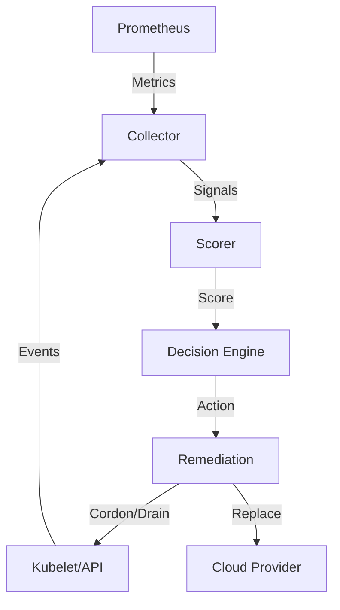

# Self-Healing Kubernetes Node Pool Controller - Architecture

## 1. Overview
A production-grade controller that detects early node degradation and safely remediates nodes before they cause outages.

### Problem
Node-level issues (IO wait, packet drops, subtle memory pressure) often go undetected by standard K8s condition checks until they cause cascading pod failures.

### Solution
Proactive continuous monitoring of node health signals + automated remediation (Cordon, Drain, Replace).

## 2. High-Level Architecture

### Components

1.  **Node Health Collector**
    - Scrapes Prometheus (node-exporter).
    - Watches Kubelet metrics & K8s Events.
2.  **Scoring Engine**
    - Normalizes signals into a 0.0-1.0 health score.
    - Uses weighted averages (e.g. DiskIO=30%, KubeletErrors=20%).
3.  **Decision Engine**
    - Determines if a node is "Degraded" or "Unhealthy".
    - Enforces safety checks (PDBs, MaxUnavailable).
4.  **Remediation Executor**
    - Cordon -> Drain -> Replace (Cloud Hook).

## 3. Data Flow



## 4. CRD: NodeHealingPolicy

```yaml
apiVersion: infra.example.com/v1alpha1
kind: NodeHealingPolicy
spec:
  nodeSelector:
    label: worker
  thresholds:
    unhealthyScore: 0.6
  remediation:
    drainTimeout: 10m
```

## 5. Safety Guardrails
- **MaxConcurrentDrains**: Hard limit on nodes being drained at once.
- **Cooldown**: Minimum time between actions on the same node/pool.
- **PDB Respect**: Drains will block and eventually timeout if PDBs cannot be satisfied.
